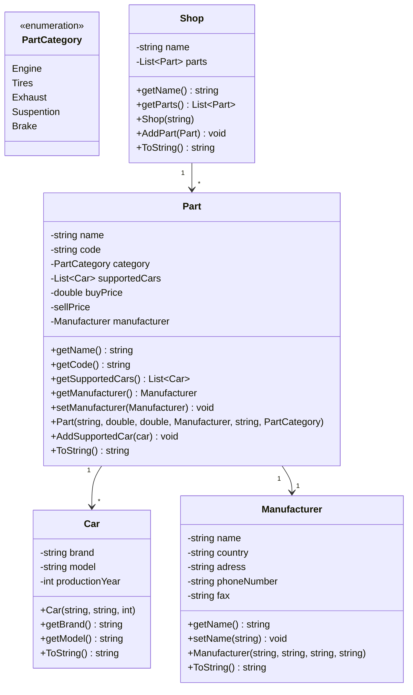

# Автомагазин

Училищен проект за автомагазин базиран на [Microsoft .NET Framework 4.7.2](https://dotnet.microsoft.com/download/dotnet-framework/net472)

## Клас-диаграма

## Документация

### Разпределение на задачите
След разглеждане на задача и внимателно планиране, ръководителят на група разпредели задачите, като се допита до всеки един участник на екипа.Преди начало на работа по проекта ръководителят на екипа изясни на другите участници основите на работа с GitLab.
След това всеки започна да прави своята част от проекта.
Класовете Part, Manufacturer и Car бяха изготвени от Здравко.
Той също оформи първоначалното състояние на формата и изготви голяма част от кода за главната програма.
Той направи бутона за вход, както и този за следващ артикул.
Класът Shop, както и алгоритъма за извеждане на наличната стока бяха създадени от Наил.
Той също така помагаше за оформяне на дизайна на формата.
Алгоритъма за търсене по име на фирма, както и по-голямата част от дизайна бяха дело на Христо.
Той също помогна за изграждане на клас диаграмата и написа голяма част от документацията.Ръководителят на екипа -
Николай имаше важна организационна роля.
Той помагаше когато някой има затруднения и движеше екипа напред.
Той направи клас-диаграмата,
описа начина на работа на програмата в документацията и направи алгоритъма за търсене по въведена марка автомобил и наименование на част.
Освен това помагаше на всички и отстръняваше неясноти в задачите.

### Начин на работа на програмата
Програмата има лесно за използване интуитивно десктоп приложение.
В първи таб се въвеждат и избират магазините на фирмата.
Във втория таб се въвежда информация за въвеждане на част и фирма в системата.
В третия клиентът може да види наличната стока.
В четвъртия се осъществява тъесене по име на фирмата и се извежда пълна информация за конкретната фирма,
заедно с частите, които произвежда за текущия магазин.
Петия таб се състои от подобно търсене, но по марка на кола и име на част.

#### Първи таб - Магацини
В бутона за добавяне се създава нов магазин с въведено име от текстовата кутия.
От списъка долу се избира магазин, за който по-нататък да се въвеждат части.

#### Втори таб - Информация за авточастите
В бутона за въвеждане се създават необходимите инстанции и се дава стойност на променливите.
Освен това нововъведената част се добавя в списък, който ще ни трябва по-късно в задачата.
В бутона за следващ артикул се изчистват всички полета, за да може потребителят да започне ново въвеждане.

#### Трети таб - Налична стока
При въвеждане тук се изписват общия брой и детайли за частите в текущия магазин.
При смяна на магазина от първия таб се сменя и съдържанието на наличната стока.

#### Четвърти таб - Търсене по име на фирма
В бутона за извеждане се извършва търсене по име на фирма, въведено от текстовата кутия до бутона и се извежда в списъка долу.

#### Пети таб - Търсене по марка
В бутона за извеждане се извършва търсене по марка на кола и име на част, въведени от текстовите кутии до бутона.
